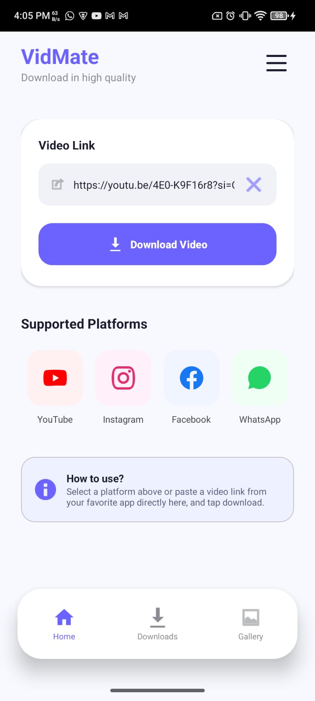
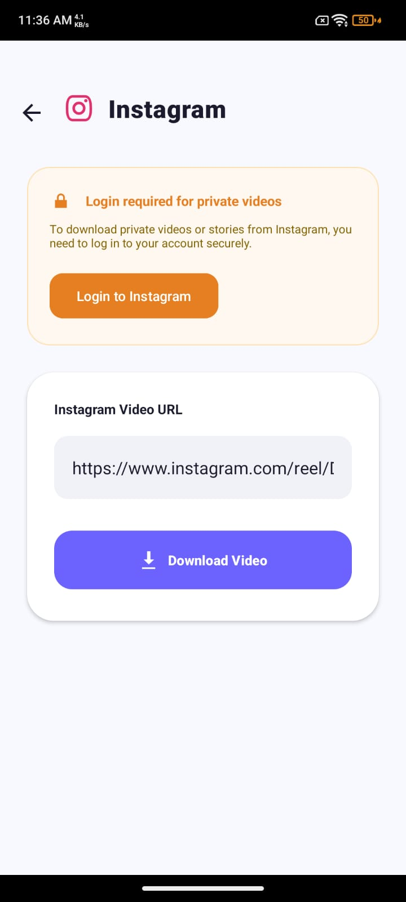
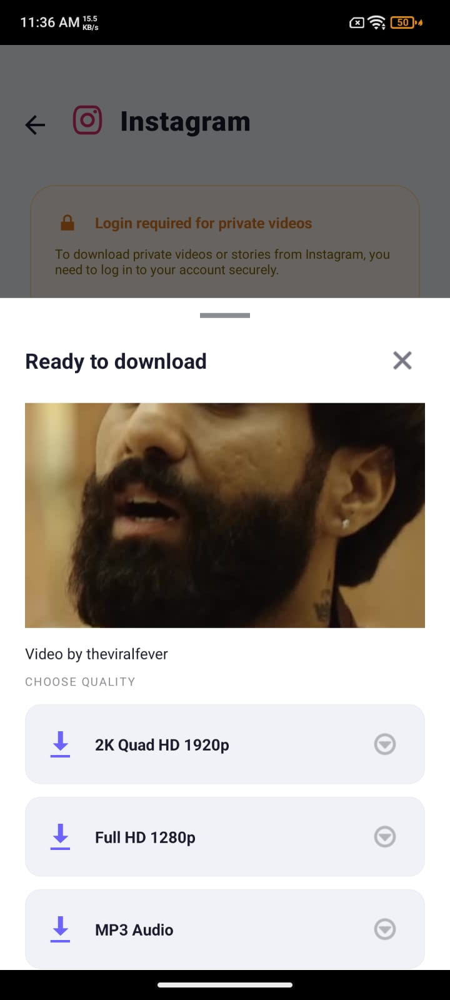

# Video Downloader

An Android application for downloading and managing media from supported platforms. The app provides a simple interface for extracting available video/audio formats, downloading media files, converting audio, and saving content directly to device storage.

## Features

### 📥 Video Downloads
- Download videos from supported platforms using a shared URL.
- Display available video and audio formats before downloading.
- Support for multiple quality options when available.
- Download progress tracking with status updates.

### 🎵 Audio Extraction
- Convert supported videos into MP3 format.
- Save extracted audio files directly to device storage.

### 📱 WhatsApp Status Saver
- Browse available WhatsApp statuses.
- Save images and videos locally.
- View saved statuses within the app.

### 📂 Download Management
- Download queue support.
- Pause, resume, and monitor downloads.
- Automatic file organization.
- Direct access to downloaded media.

### ⚙️ Media Processing
- Local media merging using FFmpeg.
- Video and audio stream handling.
- Background processing for large downloads.

### ✨ User Experience
- Clean Material Design interface.
- Built-in media preview.
- Clipboard URL detection.
- Simple one-tap download workflow.

## Technology Stack

### Android
- Java
- Android SDK
- AndroidX Libraries
- Material Components

### Media Extraction
- yt-dlp Android Wrapper
- JSON-based format parsing

### Download Engine
- OkHttp
- Multi-threaded downloading
- Background workers

### Media Processing
- FFmpeg
- Audio extraction
- Stream merging

## Screenshots

  
  
  

